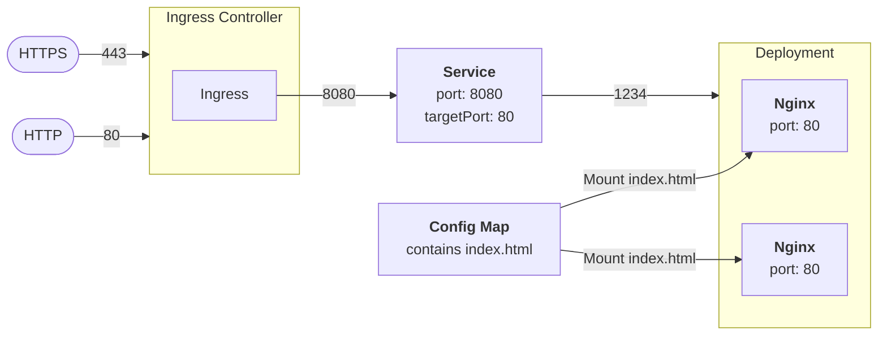

# Exercise 1 - Basic kubectl

### Listing nodes

```shell
kubectl get nodes
```

### Create and delete a namespace

```shell
kubectl create namespace workshop
kubectl delete namespace workshop
```

Lots of things can be done with params to kubectl - but we prefer descriptors

### Getting a template descriptor via kubectl

```shell
kubectl create namespace workshop --dry-run=client -o yaml
```

### Applying a descriptor

```shell
kubectl apply -f <filename>.yaml
```

## Exercise

The aim here is to deploy nginx - reading index.html from config - with ingress to service to deployment routing.

The following diagram (easiest to see on github - where it should be rendered) shows what we want to achive (although in this exercise we will only work with http - not https).



For each of these use either k9s or `kubectl get` to check the result

```shell
kubectl apply -f namespace.yaml
kubectl apply -f config.yaml
kubectl apply -f deployment.yaml
```

Use k9s or kubectl to get a port-forward setup - test in a browser.

Add a service:

```shell
kubectl apply -f service.yaml
```

It should create a ClusterIP service.

Test out making it a node port:

```yaml
type: NodePort
```

Simply edit and reapply. Then get it - you should see a value under ports > nodePort - test it by hitting `http://IP-of-any-node:nodeport/`

Less than ideal. We can test LoadBalancer - k3s by default includes klipper load balancer.

```yaml
type: LoadBalancer
```

You can now test by hitting `http://IP-of-any-node:8080/` - since that is the port the service listens to.

Finally - let's add an ingress - we don't really want to hit IPs and ports.

Set service back to no type (defaults to ClusterIP) and then:

```shell
kubectl apply -f ingress.yaml
```

This example will listen on port 8080 - so - here - you may have to adjust the hostname and you will probably have to test inside one of the VMs where /etc/hosts is setup
